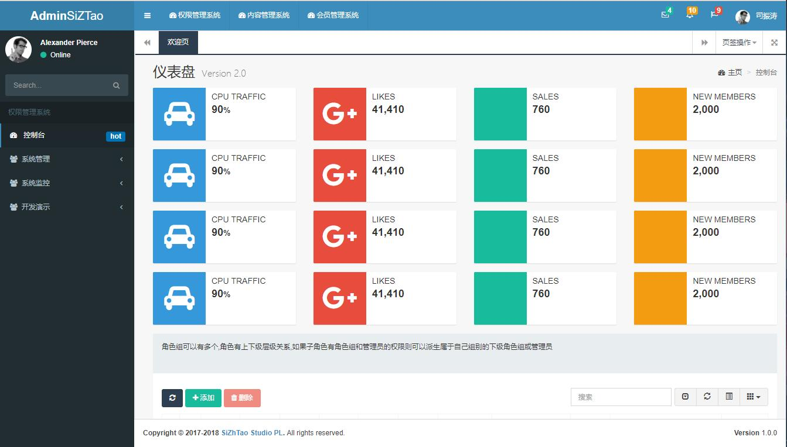
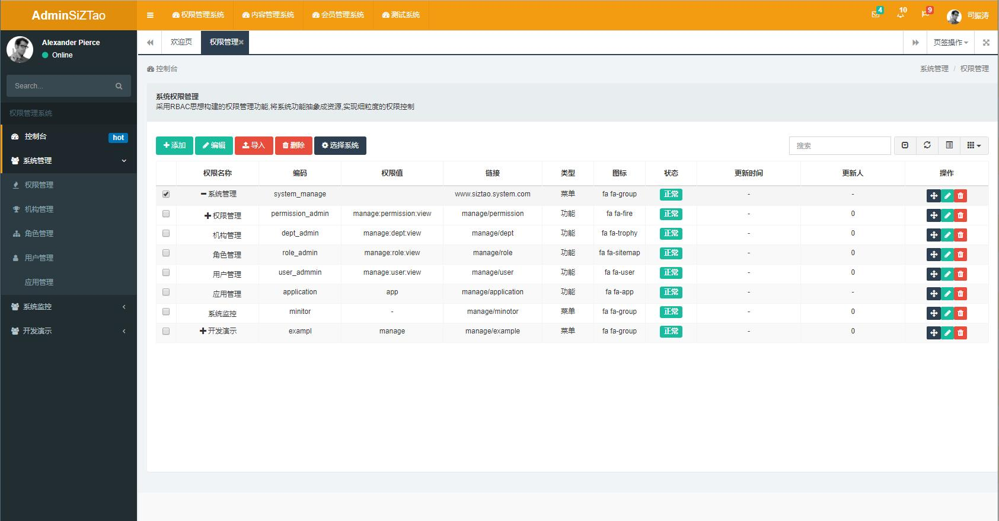
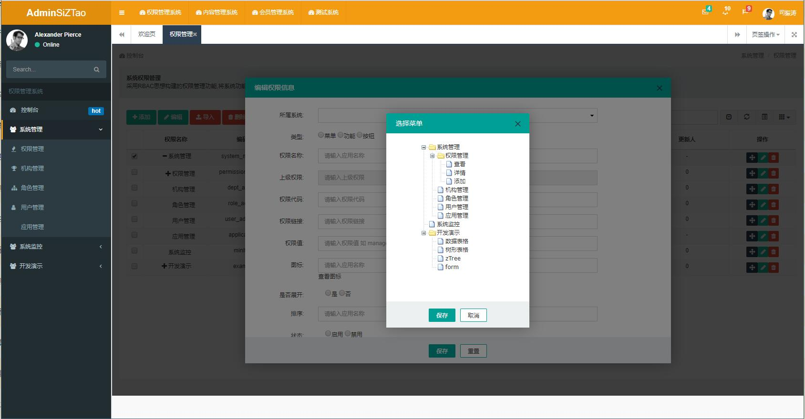
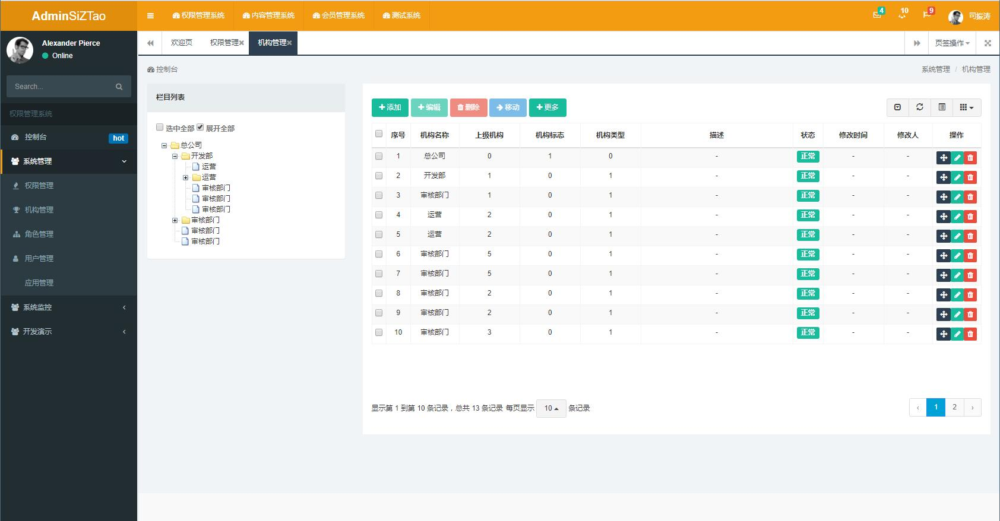
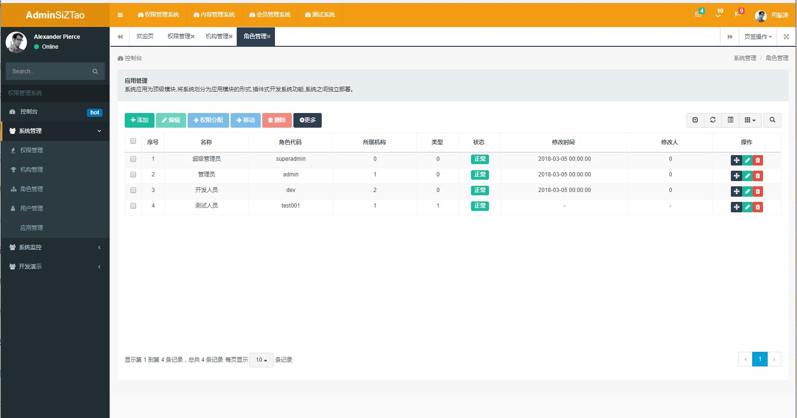
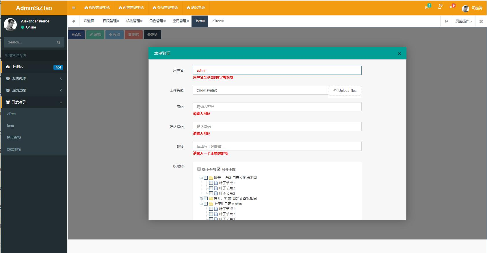

# siztao-ailicili

分布式开发框架,用于各种技术学习目标为完整的企业快速开发脚手架
实现权限管理,内容管理,资源管理

SpringFramework4.3.4    
MyBatisPlus     
sharding    分库分表
Shiro3.2    
SSO     单点登录 + 第三方登录
Freemarker &JSP &Velocity  || beetl     
swagger2    
Dubbo2.8.4  
Redis   
ActiveMQ    
Solr    
FastDFS     
quartz  
netty   
disruptor   

